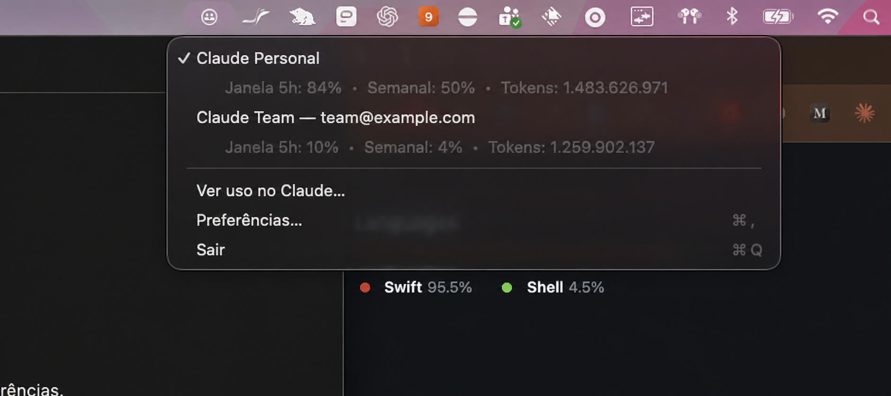

# Claude Account Switcher 1.3.5


Native macOS menu bar app for switching between isolated Claude Code profiles. The selected profile applies to new sessions; already-open sessions remain unchanged.

Current release: **1.3.5**. The distributed DMG contains a universal Apple Silicon and Intel binary when built on a macOS environment with both targets available.

Direct download: [Claude-Account-Switcher-1.3.5.dmg](https://github.com/PedroPCardoso/ClaudeAccountSwitcher/raw/main/dist/Claude-Account-Switcher-1.3.5.dmg)

### What's new in 1.3.5

- **Live usage in the menu bar.** The active account's 5-hour usage percentage now shows next to the menu bar icon, coloured by tier (green below 70%, orange 70–89%, red at 90% or more), so you can read it at a glance without opening the menu. It updates with the existing refresh and can be turned off in Preferences. With no active account or no usage data, only the icon is shown.
- **`cas` command-line companion.** A `cas` binary is installed alongside the `claude` launcher in the managed PATH, so you can switch accounts without leaving the terminal: `cas list`, `cas current`, and `cas switch <name|email>`. A switch updates the active profile, the launchd `CLAUDE_CONFIG_DIR`, and the Paseo symlink — the same path the menu uses — so the next `claude` process picks up the new profile. The desktop app is not relaunched from the CLI. Unknown or ambiguous names fail with a clear message and a non-zero exit code.
- **Aggregate usage analysis (Max vs multiple Pro).** A new **Usage analysis…** window aggregates daily token consumption across the accounts you choose, with a per-account stacked chart and a recommendation — one Max likely enough, multiple Pro justified, or inconclusive — computed from the aggregate volume. You pick which accounts feed the metric (a per-profile toggle); the selection is persisted and the chart and verdict recompute as you change it. The default is every account. (The follow-up for persisted 5h/weekly saturation history is tracked separately.)

### What's new in 1.3.2

- **Weekly credits available alert.** A native notification now fires when any account (active or not) is within 24 hours of its weekly quota renewal while still having at least a configurable share of credits available (default 30%), so unused credits don't go to waste. Multiple qualifying accounts in the same check are combined into a single notification. The threshold is set in Preferences and reuses the 5-hour alert's sound setting.

### What's new in 1.3.1

- **Reset times are now spelled out in the menu bar dropdown**, not just in Preferences, with each window labeled so it is clear the 5-hour window and the weekly window free up at different moments. The 5-hour reset appears whenever that window has active usage.

### What's new in 1.3.0

- **5-hour usage alert.** A native notification fires once when the active account crosses a configurable threshold (default 80%) of its 5-hour window, telling you when the window frees up. Threshold and sound are set in Preferences.
- **Native app relaunch is now optional and off by default.** Switching accounts no longer reopens the desktop Claude app; enable it in Preferences if you want that behavior.
- **Fix:** usage reset times (`resets_at`) now parse correctly — the endpoint returns fractional-second timestamps that the previous parser rejected, so reset times never displayed.

### Real Pro/Max usage

In Preferences and in the account menu bar tooltip, the app queries Claude Code OAuth usage directly, including the 5-hour and weekly windows. Each profile uses only the credential stored in the Keychain for its own `CLAUDE_CONFIG_DIR`; no 9router installation or other gateway is required. This is a consumer endpoint and may change without notice.

The **View Claude usage…** menu opens an internal window with per-account cards, visual progress bars, usage percentages, and reset times. The active account's 5-hour usage percentage is also shown directly in the menu bar next to the icon (toggle in Preferences).

The app also sums tokens recorded in each profile's local sessions (input, output, and cache). This represents Claude Code activity recorded locally, not a subscription token limit.

The **Usage analysis…** menu opens a window that aggregates daily token consumption across the accounts you select, drawn from each profile's local session files, with a per-account stacked chart and a plan recommendation (one Max likely enough, multiple Pro justified, or inconclusive) computed from the aggregate volume. A per-profile toggle chooses which accounts feed the metric; the selection is persisted and the chart and verdict recompute as it changes. All accounts are included by default.

### Account selector

Clicking the menu bar icon shows each account's usage directly in the selector:



## Current status

The project includes profile management, atomic persistence, Claude Code discovery, authentication through `claude auth`, a launcher, rollback-safe activation, migration, login-item support, and the menu bar interface. The build environment uses Swift Command Line Tools; the package therefore includes an executable test runner.

In **Preferences…**, you can view each account's email and status, activate, rename, remove, or re-authenticate a profile. When opened, the app refreshes authentication data using the official `claude auth status` command.

## Build and test

```zsh
cd /path/to/ClaudeAccountSwitcher
swift run ClaudeAccountSwitcherTests
swift build -c release --product ClaudeAccountSwitcher
./Scripts/build-app.sh
./Scripts/build-dmg.sh
```

The runner prints `N tests passed`. The build creates `build/Claude Account Switcher.app`, locally ad-hoc signed.
`./Scripts/build-dmg.sh` also creates `build/Claude-Account-Switcher.dmg`, ready to drag into `Applications`.

## Installation

```zsh
./Scripts/install-dev.sh
```

The script builds, copies, and opens the app. It does not migrate accounts, modify `.zprofile`, or remove aliases.

## First use

Open the app, import `~/.claude` and `~/.claude-work` through the interface, and confirm the backup before removing aliases. To add an account, choose Claude Pro/Max or Anthropic Console; the official browser login opens and the profile is stored separately.

Profiles are stored in `~/Library/Application Support/Claude Account Switcher/Profiles/`. Metadata and active state are stored alongside them. Tokens are not read from profile files by the app; Claude Code and the macOS Keychain remain responsible for credential storage.

## Integration

When repairing integration, the app installs a launcher at `~/Library/Application Support/Claude Account Switcher/bin/claude` and adds a delimited block to `~/.zprofile`. The launcher preserves all `claude` arguments and injects the active profile's `CLAUDE_CONFIG_DIR`. The app also updates the launchd environment for new graphical applications.

The default shortcut is `⌥⌘C`. Applications that were already open may need to be restarted to receive the new environment.

## Command line (`cas`)

Alongside the `claude` launcher, a `cas` companion is installed in the same managed PATH so you can switch accounts without opening the menu:

```zsh
cas list                 # list profiles; the active one is marked with *
cas current              # show the active profile
cas switch <name|email>  # activate a profile by exact name or email
```

`cas switch` applies the same change as the menu — active profile, launchd `CLAUDE_CONFIG_DIR`, and the Paseo symlink — so the next `claude` process uses the new profile. The desktop app is not relaunched from the CLI. A name that matches nothing, or more than one profile, fails with a clear message and a non-zero exit code. The menu bar reflects a CLI switch on its next refresh.

## Recovery

Before any migration, the app creates backups with a manifest. If switching fails, the previous active state is restored. Profile removal can be recovered from `Recently Removed`. To remove integration, use the repair/remove action in the app; only the delimited block is edited.

## Development

The core is in `Sources/ClaudeAccountSwitcherCore`, the UI is in `Sources/ClaudeAccountSwitcherApp`, and the runner is in `Tests/ClaudeAccountSwitcherTests`. For XCTest and development signing, install Xcode while keeping the same modules and interfaces.
